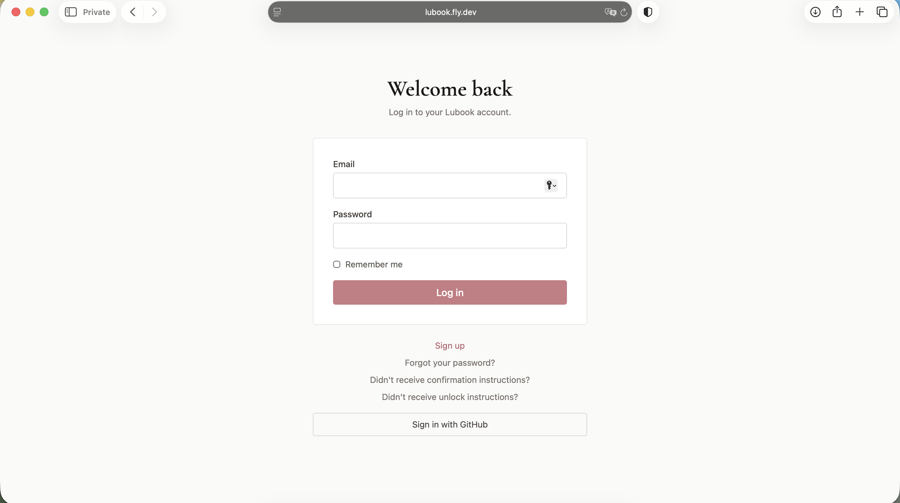

# Lubook

[](https://github.com/LautaroGartner/lubook/actions/workflows/ci.yml)
[](https://www.ruby-lang.org/)
[](https://rubyonrails.org/)
[](LICENSE)
[](https://lubook.fly.dev)

A privacy-conscious social platform built with Rails 8 and Hotwire, featuring reactive interactions, private messaging, authorization, caching, API access, and comprehensive automated testing.

**[Open the live application](https://lubook.fly.dev)**

Originally started while studying Rails, Lubook grew into a production-deployed application focused on security, performance, privacy, and maintainability.

## Live demo

[Launch Lubook on Fly.io](https://lubook.fly.dev)



## Highlights

- Email/password authentication with confirmation, password recovery, lockout, and session expiry.
- Pundit authorization across profiles, posts, comments, follows, and other sensitive actions.
- Posts, multi-image uploads, threaded comments, polymorphic likes, and follow requests.
- Private conversations with replies, image messages, unread state, read receipts, and Turbo broadcasts.
- In-app notifications plus token-authenticated JSON endpoints for native clients.
- Rack::Attack rate limits, a strict Content Security Policy, forced HTTPS, Brakeman, and dependency auditing.
- Model, policy, request, system, and JavaScript tests in a four-job GitHub Actions pipeline.

GitHub OAuth is implemented and can be enabled by supplying OAuth application credentials. It is not required for the live email/password flow.

## Architecture

```text
Browser / native client
        │
        ├── HTML + Turbo Streams + Stimulus
        └── JSON API + hashed API tokens
                         │
                    Rails 8 application
                  ┌──────┼──────────┐
                  │      │          │
              PostgreSQL Mail     Active Storage
              (Supabase) (Postmark) (Fly volume)
```

The web interface uses server-rendered Rails views and Hotwire instead of a client-side SPA. Turbo Stream responses update likes, comments, chat messages, notifications, and unread indicators without full-page reloads.

The current single-instance production deployment uses a bounded in-memory cache and the in-process `async` job adapter. Solid Cache and Solid Queue are installed and configured as the planned durable path, but are not enabled in production yet. Solid Cable backs Action Cable. See [production foundations](docs/production_foundations.md) for the operational details and migration plan.

## Core data model

```text
User
 ├── Profile + avatar
 ├── Posts ── Images, Comments, Likes
 ├── Requested/received Follows
 ├── Conversation Participants ── Conversations ── Messages + Images
 ├── Received/triggered Notifications
 └── Hashed API Tokens
```

Database constraints and indexes complement model validations. Likes use a polymorphic association, follows use an explicit pending/accepted state, and conversation membership is represented independently from messages. Account deletion cascades through owned records to avoid orphaned data.

## Performance decisions

- Post fragments use Russian-doll caching keyed by `updated_at`.
- Likes and comments touch their parent post so affected fragments invalidate automatically.
- Interactive controls sit outside cached fragments and update through targeted Turbo Streams.
- Follower counts use low-level caching with a five-minute TTL.
- Feed, profile, and post queries preload the associations needed by their views; Bullet monitors regressions in development.

On a warm cache, this substantially reduces repeated view rendering while preserving correct per-user controls.

## Security and privacy

- Devise provides confirmable, lockable, trackable, timeoutable, and recoverable authentication.
- Pundit policies are tested against owner, stranger, and unauthenticated-user cases.
- Rate limits cover login, signup, post creation, comments, and follow requests.
- CSP nonces, HTTPS/HSTS, upload validation, parameterized queries, and database uniqueness constraints provide defense in depth.
- CI runs Brakeman and `bundler-audit`; the badges above reflect the current `main` branch rather than a static claim.
- Production secrets are stored by Fly.io and are not committed to the repository.

Active Storage URLs are not currently protected by viewer-level authorization. Authenticated media proxying is the next important privacy improvement for private chat and restricted-content media. See [production foundations](docs/production_foundations.md#media-privacy).

## Testing and CI

The RSpec suite covers models, policies, requests, and critical system flows. FactoryBot and Faker provide isolated data, while Capybara exercises signup, posting, following, and liking across application layers.

```bash
bundle exec rspec
bin/rubocop
bin/brakeman --no-pager
bundle exec bundler-audit check --update
```

GitHub Actions runs tests against PostgreSQL alongside linting, static analysis, and dependency vulnerability scanning.

## Run locally

Prerequisites: Ruby 3.4.6, PostgreSQL, and libvips.

```bash
git clone https://github.com/LautaroGartner/lubook.git
cd lubook
bundle install
cp .env.example .env
bin/rails db:create db:migrate db:seed
bin/dev
```

Open [http://localhost:3000](http://localhost:3000). Development email is rendered locally through Letter Opener.

To exercise fragment caching locally:

```bash
bin/rails dev:cache
```

## Optional GitHub OAuth

Register an OAuth application at [GitHub Developer Settings](https://github.com/settings/developers) with:

- Homepage: `http://localhost:3000`
- Callback: `http://localhost:3000/users/auth/github/callback`

Then add `github.client_id` and `github.client_secret` to Rails encrypted credentials.

## Production

Lubook runs on Fly.io in São Paulo with Supabase Postgres, Postmark transactional email, HTTPS, and a mounted volume for uploads. Each deployment builds the Docker image, runs `bin/rails db:prepare` as a release command, and replaces the application machine only after the `/up` health check succeeds.

See [production foundations](docs/production_foundations.md) for required secrets, domain configuration, storage options, background-work limitations, and the private-media roadmap.

## Documentation

- [Production foundations](docs/production_foundations.md)
- [Native iOS API](docs/native_ios_api.md)

## Known limitations

- A short product demo recording has not yet been added to this repository.
- GitHub OAuth requires deployment-specific credentials and is not part of the verified public demo path.
- Cache and jobs are process-local in the current single-machine deployment.
- Private media needs authenticated proxy delivery before Lubook can promise viewer-level file privacy.

## License

[MIT](LICENSE)
